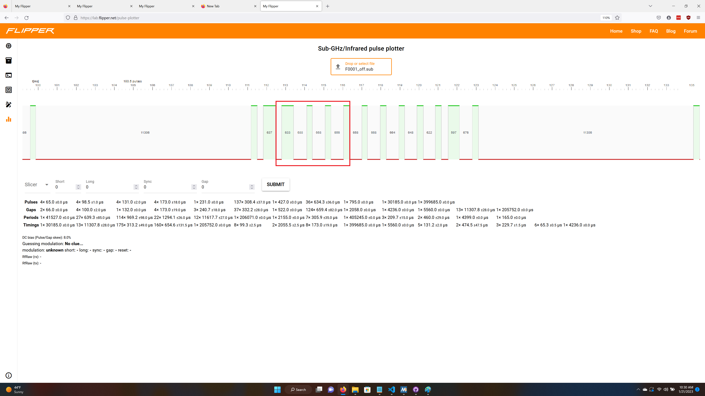

# fz_fan_controls
 Analyzing radio signals of a simple ceiling fan and python script to generate flipper zero .sub files.  

# Motivation

I recently got a Flipper Zero and wanted to learn the sub-Ghz radio features.  I initially looked at some more complex radios, but decided I had too many knowledge gaps.  So, I picked the simplest radio transmitter I could find in the house.  I have never worked with radio transceivers professionally or as a hobby.  The closest thing I've looked at is IR remote transmitters and receivers.  This was a good method to learn how to use the "Raw Read" feature and interpret the captured files.  Then write a simple script to generate the files and control the radio.  I also found the documentation of these simple fan control protocols is sparse.  

# The Fan Hardware

I wasn't motivated enough to take apart the remote or pull the wall control out, so I basically looked on Amazon to find a similar looking fan control.  I found [this](https://www.amazon.com/Eogifee-Universal-Ceiling-Control-UC-9050T/dp/B08DM49LHV/ref=sr_1_50?crid=105P4GFNQWPR0&keywords=fan%2Bremote&qid=1674324698&sprefix=fan%2Bremot%2Caps%2C146&sr=8-50&th=1).  Basically, this looks to be a copy of an older Harbor Breeze fan control.  This particular device used a 303.9Mhz radio and has the same dip switches as my remote.  Presumably it is similar.

# The Signal

I setup the Flipper Zero to do Read RAW at 303.875Mhz with AM650 modulation, based on what I read in the Amazon listing.  I also set the Threshold to -70dB.  With no threshold, the capture is large and full of garbage.  At -70dB, the Flipper Zero captured only when I pressed the button on the remote.  The .sub files are in the [captured_fans] directory.  The captured signals are already demodulated.  The negative numbers are the number of microseconds the signal is low and the positive numbers are the number of microseconds the signal is high.  For some reason, this was not obvious to me even after reading descriptions of the file format a couple times.  

Here's the first capture pressing the "Low" button.  It seems to be a bunch of repeated sequences.  

## Button Press Encoding

Zooming in one sequence, this is what we see.  In order to understand what the pulses mean, we need to capture different button presses.  I included images of the "Low" and "Medium" buttons.  I captured all 5 buttons on the remote.  

First off, this appears to be PWM encoding.  I have looked at IR remote encoding before and this does not look like the NEC or Manchester encoding I've seen in the past.  An encoded 0 looks like a longer low period followed by a short high period.  A 1 looks like a short low period followed by a long high period.  I may have that backwards, but as long as I'm consistent, the signals can be decoded.  

From looking at all 5 button presses, I found the last 6 bits of the sequence encode the button.  If all 6 bits are 0b, then it is transmitting that no button is pressed.  Each bit represents a different button.  The remote only has 5 buttons, so one of the bits is not used.  Presumably that was for expansion that never happened or different hardware with more features.  Maybe there is a version where the remote has a fan reverse button.  Later, I hacked together a .sub file that encoded this unused button and it did not seem to do anything with my fans.  

The below image shows the button bit positions.  

## Fan Address Encoding

After determining which bits in the sequence represent button pushes, I wanted to understand how the dip switches on the remote influence the sequence.  Some documentation for the remotes refer to the switches as setting the "frequency."  This is wrong.  The remote seems to transmit on the same frequency and use the same period for the bit patterns no matter what dip switch setting is used.  Here are two captures with different dip switch settings. 

The highlighted bit sequence encodes the dip switch settings.  Presumably, the fan canopy module matches the address pattern with its own dip switch settings to determine if it should react to the sequence.  The 4 switches allow encoding of up to 16 different fan addresses.  That should cover most residential installations.  

## Dimmer Encoding

The remotes have a dip switch to enable dimmer control of the light.  This seems to simply change one bit in the sequence.  If the dip switch is set, the bit is transmitted as a 1, if not, it is sent as a zero.  

## Start Sequence

The transmit pattern always starts with a short high pulse, short low pulse and then a long high pulse.  This is kind of like a 01b start sequence.  No matter what switch settings or button is pressed, the sequence seems to start with this 01b sequence.  

## Put it all together

This image shows one full sequence.  

## A Full Transmission

The remote will send the button press sequence many times.  I generally saw 7 to 10 sequences sent with the button press encoded.  I also often saw a few sequences indicating none of the buttons are pressed.  The remote probably sends button press sequences the entire time the button is pressed and then sends a couple sequences indicating no button is pressed when the user stops pressing the button.  

The remote should send multiple sequences to improve reliability.  There is no downside to sending multiple sequences, other than maybe wasting a little power.  The batteries in the handheld remote last years.

# The Python Script

The script generates .sub files to control a fan.  I wanted to prove I could generate a correct .sub file based on decoding the packet and then play that .sub file on the Flipper Zero.  The samples I captured indicate a full bit is transmitted in 1020us on average.  The script splits the 1020us cycle time into 1/3 and 2/3 time for the low or high part of the cycle.  A zero is transmitted as 2/3*1020us low and 1/3*1020us high.  A one is transmitted as 1/3*1020us Low and 2/3*1020us high.  

## Leading Gap

The captured sequences seem to put a 11.5ms gap between sequences, so the script generates a long low gap the same way.  

## Repeated Sequences

The script will transmit the button press sequence 5 times and a no button pressed sequence 3 times.  

## Output Files

The script outputs a unique file name for each of the 5 button presses.  The user can play back each .sub file to emulate a complete remote.  

## Universal Files

One valuable output is a .sub file that sends the same command to all 16 possible addresses.  If you want to carry around the universal .sub file for turning the fan off or flipping the light to try out in the world, this is your command line parameter.  